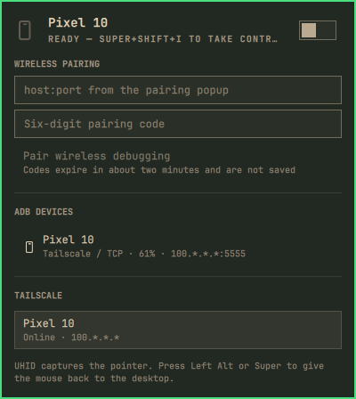

# Taildroid

Control an Android phone from the Omarchy bar with the computer mouse and
keyboard. Super+Shift+I toggles a [scrcpy](https://github.com/Genymobile/scrcpy)
session over USB or Tailscale ADB.



## Install

From the Omarchy menu: **Setup › Plugins › Add Plugin**, then paste the Git URL.

From a terminal:

```sh
omarchy plugin add https://github.com/raythurman2386/taildroid.git --enable
```

Review the plugin trust warning before enabling. Third-party plugins run
unsandboxed inside `omarchy-shell`.

That adds the bar widget. The Super+Shift+I shortcut is extra setup you apply
yourself — nothing here overwrites `~/.config/hypr`.

```lua
-- ~/.config/hypr/bindings.lua
o.bind("SUPER + SHIFT + I", "Taildroid", "omarchy-shell ret.taildroid toggleControl")
```

Reload Hyprland after adding the bind.

## Use

Left-click the bar icon for the panel. Right-click, or Super+Shift+I, starts or
stops control. UHID captures the pointer; press **Left Alt** or **Super** to
give the mouse back to the desktop.

On the phone, enable Developer options, USB debugging, and Wireless debugging.

- **USB once, then Tailscale:** accept the debugging prompt, run
  `adb tcpip 5555`, then connect from the panel.
- **Pairing code:** open **Wireless debugging → Pair device with pairing
  code**, enter the host:port and six-digit code in the panel, then connect.
  Pairing codes expire in about two minutes and are not saved.

Addresses in the panel are redacted (`100.*.*.*:5555`). Pairing fields stay
editable so you can type the real host:port.

```sh
omarchy-shell ret.taildroid toggleControl
omarchy-shell ret.taildroid start
omarchy-shell ret.taildroid stop
omarchy-shell ret.taildroid connectTailscale
omarchy-shell ret.taildroid pair host:port 123456
omarchy-shell ret.taildroid status
```

Move the bar icon:

```sh
omarchy bar move ret.taildroid --section right
```

## Remove

```sh
omarchy plugin remove ret.taildroid
```

Removing the plugin does not undo a Super+Shift+I bind you added by hand.

## Requirements

Omarchy 4 with the Quattro shell (Quickshell). Install the tools you need:

```sh
omarchy pkg add android-tools scrcpy
```

Tailscale is optional and only used for wireless ADB to an Android peer.

## License

MIT.
